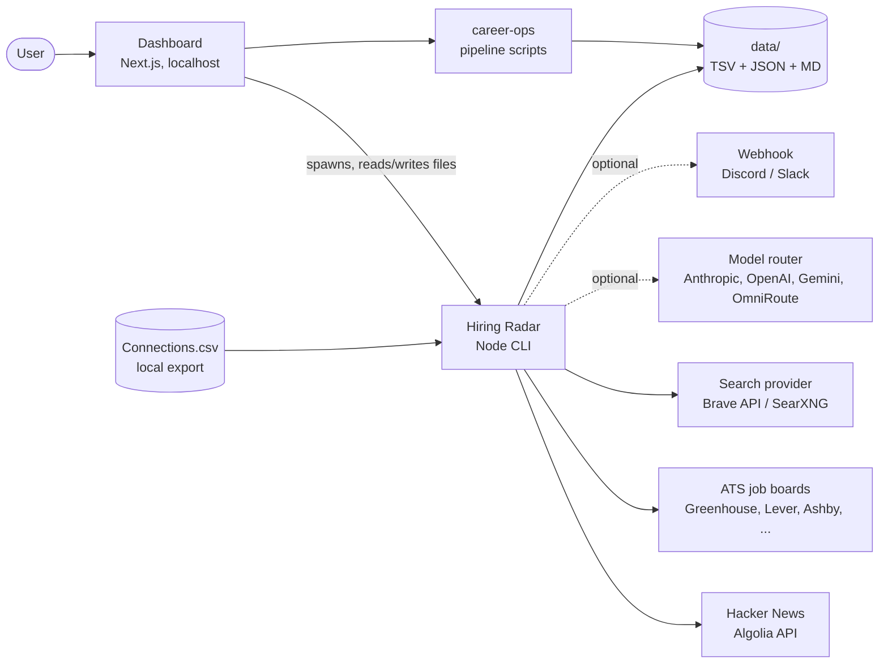
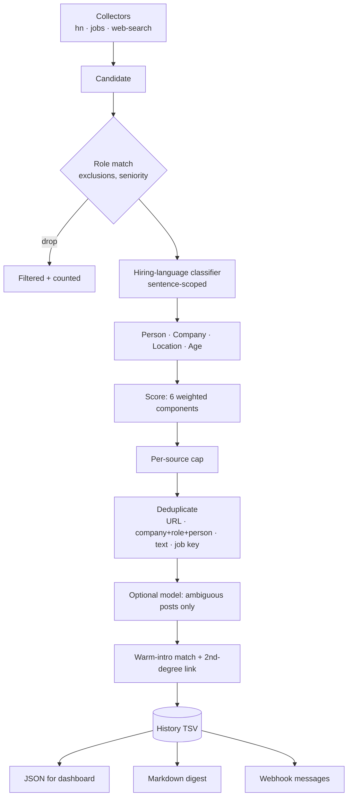

<div align="center">

# CareerReboot

**A local-first job-search platform: discover who is hiring, build the CV, track every application.**

[](LICENSE)
[](#requirements)
[](CITATION.cff)

</div>

CareerReboot combines three capabilities behind one dashboard. Everything runs on your machine; nothing is sent, submitted or applied to without an explicit action by you.

| Capability | What it does |
|---|---|
| **Hiring Radar** | Scans public sources daily for people and companies actively hiring for roles that match your profile, scores each result with an explainable breakdown, and flags warm introductions from your own LinkedIn export. |
| **CV builder** | Edits and renders a Markdown or LaTeX CV and produces tailored PDFs per role. |
| **Pipeline** (career-ops) | Scans ATS job boards, evaluates roles, tracks applications to an outcome, schedules follow-ups, drafts outreach. |

## Contents

1. [Product modes](#product-modes) · 2. [Architecture](#architecture) · 3. [Hiring Radar](#hiring-radar) · 4. [Security and privacy](#security-and-privacy) · 5. [Requirements and installation](#requirements-and-installation) · 6. [Running](#running) · 7. [Configuration](#configuration) · 8. [Deployment](#deployment) · 9. [Development](#development) · 10. [Compliance](#compliance) · 11. [Citations](#citations) · 12. [License](#license)

## Product modes

The home page offers three entry points over a dimmed background video. The choice is stored in the browser and filters the navigation. The **Settings** button at the bottom of the home page (and in the sidebar) opens one popup for every per-user setting; see [Configuration](#configuration).

| Mode | Includes |
|---|---|
| **Complete** | Dashboard, Explore, Research, Follow-ups, Hiring Radar, Portals, Analytics, CV, Config. |
| **Fast paced** | Hiring Radar and the CV builder. |
| **CV builder** | The CV builder only. |

## Architecture



| Component | Path | Responsibility |
|---|---|---|
| Dashboard | `agents/career-ops/web` | UI, mode launcher, thin API routes that supervise CLIs and edit local config. No business logic. |
| Hiring Radar | `agents/hiring-radar` | Collect → normalise → score → deduplicate → persist → render → notify. Pure Node ESM, one dependency (`js-yaml`). |
| career-ops | `agents/career-ops` | Application pipeline, ATS provider plugins, CV rendering, tracker. Reused by Hiring Radar (providers, CLI helpers, connection matcher). |
| Outreach | `agents/outreach` | Skill that drafts messages from tracker and Hiring Radar context. Draft-only. |
| Deploy | `deploy/` | GCP VM scripts; optional OmniRoute gateway. |

### Design principles

- **Deterministic first.** HTTP, parsing, deduplication, scoring and date logic are plain code. A model is used only for ambiguous classification and short explanations, and everything works with it disabled.
- **Isolated failure.** One failing source, record or provider never stops a scan; the run reports exactly what failed.
- **Explainable scores.** Every score ships with its components and weights.
- **Human in the loop.** The system discovers and drafts. It never contacts anyone.

## Hiring Radar

### Data flow



### Sources

| Source | Data | Credentials |
|---|---|---|
| `hn` | Monthly "Who is hiring?" thread (public API) | none |
| `jobs` | Employer ATS job boards through career-ops providers; company list from `portals.yml` or `config.yml` | none |
| `web-search` | Targeted queries generated from roles, phrases and skills; hosts are allow-listed; responses cached | `BRAVE_SEARCH_API_KEY` and/or `SEARXNG_URL` |

Providers are tried in order and fall through on error or an empty answer. LinkedIn is never accessed directly.

### Scoring

```
overall = 0.35·technical + 0.25·activity + 0.15·direct_language
        + 0.10·person    + 0.10·location + 0.05·company
```

| Component | Definition |
|---|---|
| technical | Role base (target 70, adjacent 35, unknown 20) plus matched-skill points (capped at 30), minus seniority penalty. Contributors are listed per result. |
| activity | Step decay by age: <12 h 100, <24 h 90, <48 h 80, <96 h 65, <7 d 45, <14 d 25, older 10, unknown 30. Re-evaluated on every render. |
| direct_language | First-person hiring with a role 100 down to vague recruiting copy 30; job posting 70. Negations ("recently hired", "welcome to the team") are excluded. |
| person | Founder/CTO/VP/head/EM 100, recruiter 75, other 60; scaled by confidence (HIGH 1.0, MEDIUM 0.8, LOW 0.4); none = 0. People are never inferred. |
| location | NYC/NJ 100, remote US 90, other US 60, unknown 50, non-US 0 (dropped by default). |
| company | Base 50, plus domain relevance and presence in `portals.yml`. |

All weights, bands, role families, skills and phrases are configuration (`agents/hiring-radar/config.example.yml`).

### Storage

Under `agents/career-ops/data/` (git-ignored):

| File | Content |
|---|---|
| `hiring-signals.tsv` | History ledger. `status`: NEW, SEEN, REVIEWED, CONTACTED, DISMISSED, CONVERTED. Retention 90 days (CONTACTED/CONVERTED kept). |
| `hiring-signals.json` | Normalised results with score breakdowns, consumed by the dashboard. |
| `hiring-radar.md` | Daily digest. |
| `hiring-signals-deleted.txt` | Keys of deleted results so rescans do not restore them. |
| `Connections.csv` | Your LinkedIn export, if provided. |

### Operations in the dashboard

Results can be filtered by status, type, source, connection, person, location, role, age, score and text; sorted by score, signal date or discovery time; selected in bulk to mark, dismiss or delete. Opening a result marks it SEEN. Each company links to LinkedIn's own 2nd-degree people search (opened in your browser; never fetched by the application).

## Security and privacy

- **Local-first.** Data, keys and the connections export live in git-ignored files. The dashboard binds to localhost and has **no sign-in**; do not expose it. A same-origin/loopback guard protects every `/api/*` route. Add authentication before any shared hosting.
- **Secrets** are read only from `.env` files or CI secrets, redacted from logs, written with mode 600, and never returned to the browser.
- **Data egress** happens only to services you configure: search queries to the search provider; short post excerpts plus a roles/skills summary (never email, phone or full CV) to the model provider; result summaries to the webhook.
- **Network behaviour.** Bounded concurrency, per-host spacing, timeouts, exponential backoff with jitter, `Retry-After` honoured, search results cached 22 h, query volume capped (8 per run by default).
- **No automation of third-party accounts.** No LinkedIn login, scraping, or anti-bot circumvention; nothing is auto-sent or auto-submitted.

## Requirements and installation

### Requirements

Node.js ≥ 20.12 and npm. Optional: Docker (SearXNG, OmniRoute), [uv](https://docs.astral.sh/uv/) (Graphify).

### Installation

```bash
git clone https://github.com/shreyasbhakta/CareerReboot.git && cd CareerReboot
npm run setup                          # installs career-ops (no browser download), hiring-radar and the dashboard
```

Then open the dashboard, click **Settings**, and create your local files from the examples (profile, Hiring Radar, job research, portals). Each starts from placeholders and is validated before it is saved.
```

## Running

| Task | Command |
|---|---|
| Dashboard | `cd agents/career-ops/web && npm run dev` → http://localhost:3000 |
| Scan (writes results) | `npm run hiring-radar` |
| Scan preview (writes nothing) | `npm run hiring-radar:dry-run` |
| Scan options | `node agents/hiring-radar/scan.mjs --days 7 --source jobs --min-score 70` |
| Validate a config override | `node agents/hiring-radar/scan.mjs --check-config path/to/config.yml` |
| Start fresh (dry run, then `-- --yes`) | `npm run reset` moves generated data and caches to `.careerreboot-backups/`; config, secrets, CV and LinkedIn exports stay |

Scheduling: the **Schedule** tab installs a user crontab entry; `deploy/gcp/crontab.example` covers a VM; `.github/workflows/hiring-radar.yml` runs daily at ~07:35 America/New_York and on demand (results published as a workflow artifact and job summary, history persisted with the Actions cache; nothing is committed).

## Configuration

Every per-user setting is a git-ignored local file next to a committed example that holds only placeholders. The **Settings** popup lists them all (registry: `agents/career-ops/web/src/lib/settings.ts`), validates edits, keeps a `.bak-*` copy of the previous version and writes with owner-only permissions. Nothing personal is committed.

| Flow | Local file (git-ignored) | Example (committed) |
|---|---|---|
| Profile: name, roles, narrative | `agents/career-ops/config/profile.yml` | `config/profile.example.yml` |
| Hiring Radar: locations, roles, skills, scoring (overrides only) | `agents/hiring-radar/config.yml` | `config.example.yml` |
| Job research scorer | `job-finding-research/candidate-profile.yml` | `candidate-profile.example.yml` |
| Portals tracked by the scanner | `agents/career-ops/portals.yml` | `templates/portals.example.yml` |
| Secrets | `agents/hiring-radar/.env` (Hiring Radar → Keys & data) or CI secrets | — |
| Appearance: background video on/off, theme | browser storage | — |

| Variable | Purpose |
|---|---|
| `BRAVE_SEARCH_API_KEY`, `SEARXNG_URL` | Search backends |
| `MODEL_PROVIDER` (`anthropic`, `openai`, `gemini`, `openrouter`, `omniroute`, `ollama`), `MODEL_NAME`, `MODEL_BASE_URL` | Optional model routing; off unless `MODEL_PROVIDER` is set |
| `ANTHROPIC_API_KEY`, `OPENAI_API_KEY`, `GEMINI_API_KEY`, `OPENROUTER_API_KEY`, `OMNIROUTE_API_KEY` | Provider keys |
| `HIRING_RADAR_NOTIFY`, `HIRING_RADAR_WEBHOOK_URL` | Webhook notifications |
| `LINKEDIN_CONNECTIONS_CSV` | Path to the connections export |
| `HIRING_RADAR_DATA_DIR`, `HIRING_RADAR_CONFIG` | Redirect output / add a config file |

### GitHub Actions

Secrets: `BRAVE_SEARCH_API_KEY`, `SEARXNG_URL`, provider keys, `HIRING_RADAR_WEBHOOK_URL`, `LINKEDIN_CONNECTIONS_CSV_B64`, `HIRING_RADAR_CONFIG_YML`. Variables: `MODEL_PROVIDER`, `MODEL_NAME`, `MODEL_BASE_URL`, `HIRING_RADAR_NOTIFY`. On a public repository, results are not published when connection data is loaded.

## Deployment

| Target | Reference |
|---|---|
| Local | This document |
| Always-on VM | `deploy/gcp/README.md` (cron + systemd, reached over an SSH tunnel) |
| CI schedule | `.github/workflows/hiring-radar.yml` |
| Optional services | `agents/career-ops/deploy/searxng` (search), `deploy/omniroute` (model gateway) |

## Development

```bash
npm test                      # Hiring Radar suite (offline, fixture-based)
npm run test:web              # dashboard typecheck + tests
npm run test:all              # everything CI runs (.github/workflows/ci.yml)
npm run graph                 # refresh the Graphify code graph (uv tool install graphifyy)
```

- **Conventions** for contributors and coding agents are in `AGENTS.md`: least-code ladder ([Ponytail](https://github.com/DietrichGebert/ponytail)), graph-first navigation ([Graphify](https://github.com/Graphify-Labs/graphify)), comment style, guardrails. The Ponytail Claude Code plugin is pre-registered in `.claude/settings.json`.
- **Skills** follow the [Agent Skills](https://github.com/agentskills/agentskills) format (`agents/hiring-radar/skills`).
- **Architecture decisions:** [`docs/architecture/hiring-radar.md`](docs/architecture/hiring-radar.md).
- **Releases** are annotated tags (`vMAJOR.MINOR.PATCH`) on `main`.

### Repository layout

```
agents/career-ops        pipeline + dashboard (web/)
agents/hiring-radar      scanner, scoring, storage, formatters, tests, skills
agents/outreach          draft-only outreach skill
deploy/                  GCP scripts, OmniRoute compose
docs/architecture        design records
.github/workflows        CI on every PR, scheduled scan
scripts/                 workspace tools (reset)
```

## Compliance

- Not affiliated with LinkedIn, Indeed, Y Combinator, Greenhouse, Lever, Ashby, Workday, Brave or any model vendor; trademarks belong to their owners.
- Only public, documented endpoints and a search provider you configure are used, under each provider's terms. LinkedIn is never accessed programmatically; the connections file is your own export, kept local.
- Outputs (scores, summaries, drafts) are decision aids and may be wrong; verify before acting. Visa and compensation information is not legal or financial advice.
- Third-party data remains the property of its authors; store excerpts and links for personal use only.
- The background video streams from a third-party CDN, so opening the dashboard makes that one request; switch it off in Settings → Appearance.
- In-app notice: `/legal`. Licences of dependencies: [`THIRD_PARTY_NOTICES.md`](THIRD_PARTY_NOTICES.md).

## Citations

1. Fernández de Valderrama, S. *career-ops*. MIT. https://github.com/career-ops-hq/career-ops — pipeline, ATS providers, modes.
2. *ResumeSkills*. MIT. `skills/resume-skills/NOTICE.md` — CV and outreach skill library.
3. Gebert, D. *Ponytail*. MIT. https://github.com/DietrichGebert/ponytail — least-code ruleset adapted in `AGENTS.md`.
4. Graphify Labs. *Graphify*. Apache-2.0. https://github.com/Graphify-Labs/graphify — code knowledge graph for contributors.
5. *OmniRoute*. MIT. https://github.com/diegosouzapw/OmniRoute — optional local AI gateway.
6. *Agent Skills specification*. Apache-2.0. https://github.com/agentskills/agentskills — `SKILL.md` format.
7. Y Combinator. *Hacker News API*. https://github.com/HackerNews/API; Algolia. *HN Search API*. https://hn.algolia.com/api
8. Greenhouse, Lever, Ashby, Workday public job-board APIs; Brave Software. *Brave Search API*. https://brave.com/search/api/; *SearXNG*. AGPL-3.0. https://github.com/searxng/searxng
9. Next Level Builder. *UI UX Pro Max*. MIT. https://github.com/nextlevelbuilder/ui-ux-pro-max-skill — design reference for the v2 glass surfaces, gradient-ring buttons and accessibility checklist (no code vendored).
10. Background video: `hf_20260423_084718_72a17915-4964-4059-afcd-22d59399b72e.mp4`, streamed from https://d8j0ntlcm91z4.cloudfront.net/user_38xzZboKViGWJOttwIXH07lWA1P/hf_20260423_084718_72a17915-4964-4059-afcd-22d59399b72e.mp4 — supplied by the project owner; not redistributed in this repository. All rights remain with its creator.
11. Vercel. *Next.js*; Meta. *React*; *Motion* (motiondivision); *Tailwind CSS*; *lucide*; *js-yaml*; Microsoft. *Playwright* — see `THIRD_PARTY_NOTICES.md`.

To cite this software, see [`CITATION.cff`](CITATION.cff).

## License

Apache License 2.0 for code original to this repository ([LICENSE](LICENSE)). Vendored subtrees keep their original MIT terms ([THIRD_PARTY_NOTICES.md](THIRD_PARTY_NOTICES.md)).
